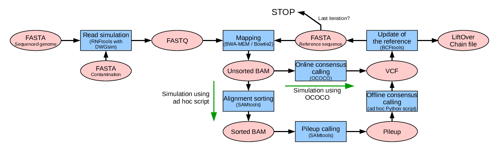
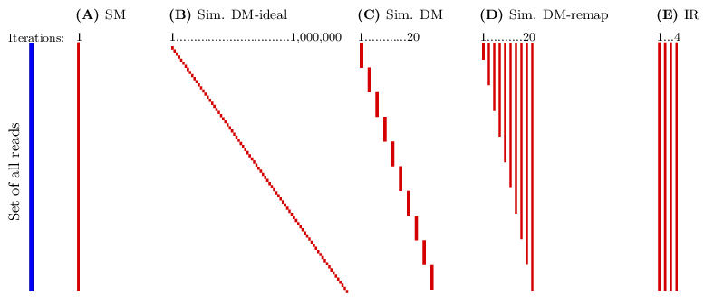

# Dynamic Mapping Simulator

## Introduction

This is a repository with Supporting Information for paper
K. Břinda, V. Boeva, G. Kucherov: Dynamic read mapping and online consensus calling for better variant detection.


Dynamic mapping is mapping to a reference, which is continuously corrected according to alignments computed so far. *Dynamic Mapping Simulator* is a pipeline to simulate dynamic mapping using existing software to evaluate its benefits in comparison to standard *static mapping* and *iterative referencing*. For more details, see the paper.

## Simulation algorithm

Simulation of dynamic mapping:


Scheme of the simulation pipeline:


Reads:


## Structure of this repository

* [docs](docs) - supplementary materials (S1 and S2 files)
* [dymas](docs) - Dynamic Mapping Simulator (Python package)
* [experiments](docs) - all runs of all experiments
* [reports](reports) - generated reports

## Reports

## Replication of results

### Prerequisities

**Experiments**

* Python 3.3/3.4
* [OCOCO](http://github.com/karel-brinda/ococo)
* [RNFtools](http://github.com/karel-brinda/rnftools)

**Additional software for reports**

* GNU Parallel
* LaTeX
* Inkscape
* Gnuplot 5

#### Recommended way of installation using [Anaconda](https://www.continuum.io/downloads)

Environment installation:

```bash
	conda create -y --name dymas \
	  -c bioconda \
		python==3.4 \
		snakemake samtools git cmake gnuplot
```

Environment activation:

```bash
source activate dymas
```

Installation of Python packages (in the activated environment)

```bash
pip install -r requirements.txt
```

### Replication steps

0. Install all required software and activate the corresponding Conda environment.

  ```bash
	source activate dymas
  ```

1. Clean existing data

  ```bash
  make clean
  ```

2. Download reference genomes

  ```bash
  make -C experiments/exp0*
  ```

3. Run experiments (this step will take several hours)

  ```bash
  make -C experiments -j 10
  ```
4. Generate reports

  ```bash
  make -C reports -j 10
  ```
